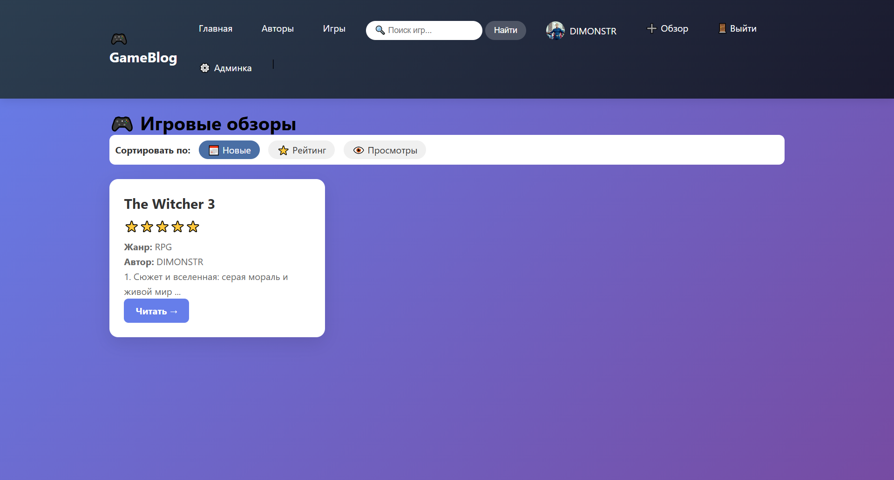
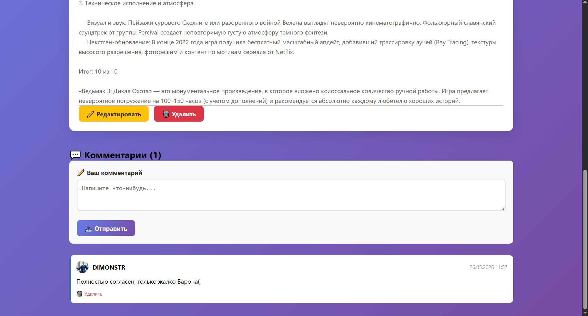
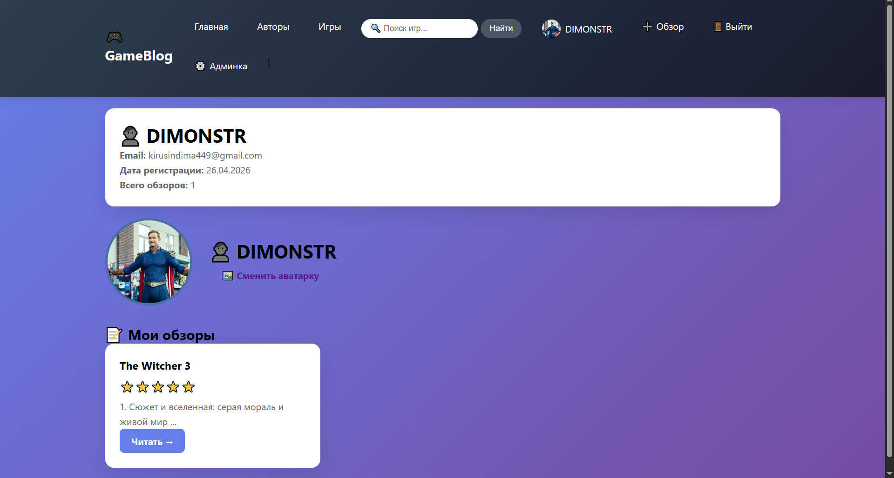
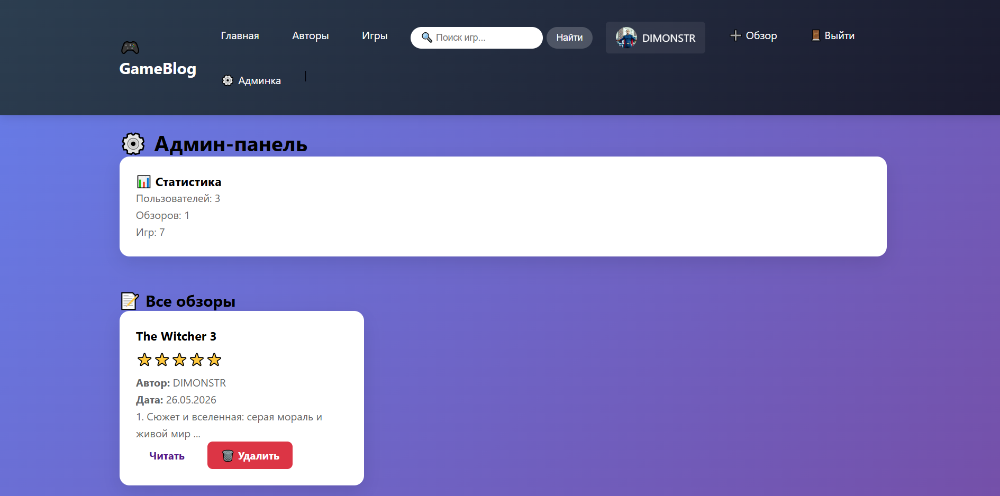
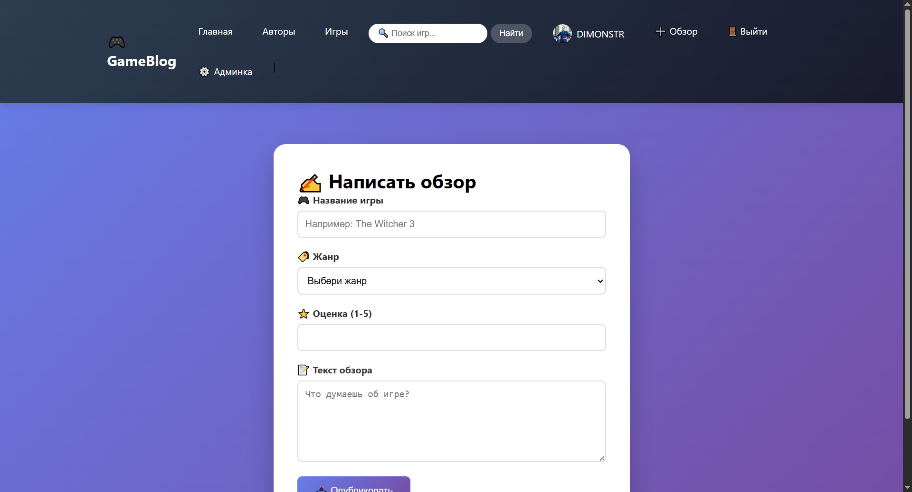

 GameBlog — Игровой блог на Flask

Живой демо-сайт: https://dimonstr.pythonanywhere.com

О проекте
GameBlog — это полноценный веб-сайт для публикации обзоров на игры. Пользователи могут регистрироваться, писать обзоры, оставлять комментарии, загружать аватарки.

 Использованные технологии
- Backend: Python 3, Flask, Flask-Login, Flask-SQLAlchemy
- Database: SQLite (локально), PostgreSQL (на сервере)
- Frontend: HTML5, CSS3, Bootstrap (адаптивный дизайн)
- Deployment: PythonAnywhere, Git, GitHub

 Основные возможности
-  Регистрация и аутентификация пользователей
-  Админ-панель (управление обзорами и пользователями)
-  Создание, редактирование, удаление обзоров (CRUD)
-  Загрузка аватарок пользователей
-  Комментарии к обзорам
-  Счётчик просмотров обзоров
-  Поиск по названию игры
-  Пагинация (разбиение списка на страницы)
-  Сортировка обзоров (по дате, рейтингу, просмотрам)
-  API для получения данных в JSON формате
-  Фильтр нецензурной лексики

## 📸 Скриншоты

### Главная страница

### Страница обзора с комментариями

### Профиль пользователя

### Админ-панель

### Добавление обзора

 Как запустить локально
bash

git clone https://github.com/kirusindima440-sys/gameblog.git
cd gameblog
pip install -r requirements.txt
python app.py
